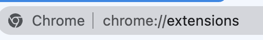
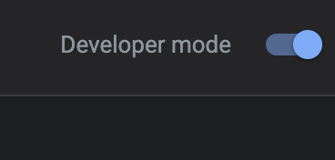
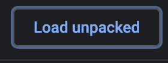
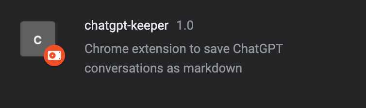
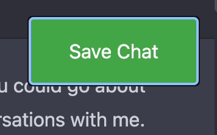
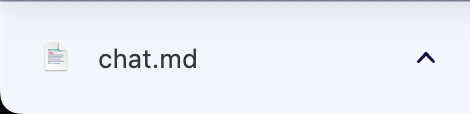

# Project Name
This project is a script that extracts specific div values from an html file, and saves the text in markdown format.  

You can start from [chrome web store](https://chrome.google.com/webstore/detail/chatgpt-keeper/mgbiokepgpjnpadhbcggcnnlnpkajhdl?hl=en-US)

## Getting Started
These instructions will get you a copy of the project up and running on your local machine.

### Prerequisites
You need to have a web browser that supports JavaScript.

### How to Use
The extension app is still under review, so please use the method below.  

1. Download the project zip file and unzip
    - [Download link](https://github.com/wjrmffldrhrl/chatgpt-keeper/archive/refs/heads/master.zip)
2. Access [chrome extensions](chrome://extensions/)  
  

3. Trun on developer mode  
  

4. Load unpacked project directory  
  

5. Check chatgpt-keeper extension  
 

6. Talk to chatgpt and click the `Save Chat` button  
  

7. Voila!  
 

## Built With
JavaScript - The programming language used
## License
This project is licensed under the MIT License - see the LICENSE.md file for details.

## Acknowledgments
This script uses the HTML DOM Parser library to parse the html file.
## Note
This script follows the Content Security Policy for Chrome Apps, so all JavaScript and all resources should be local.
The script does not rely on any npm package.
